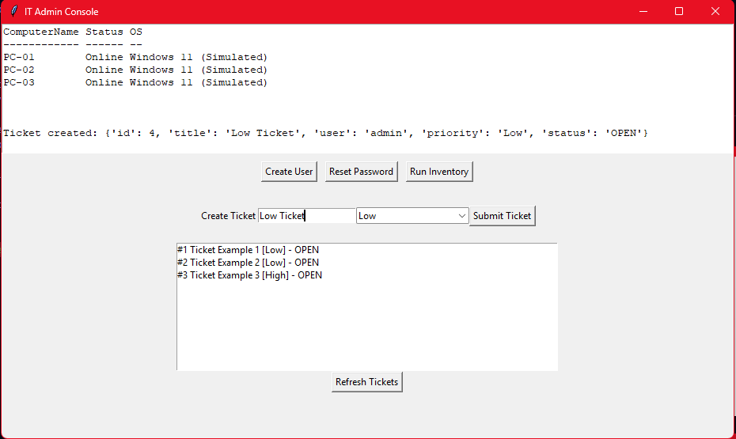

# IT Automation Admin Console (PowerShell + Python)
A role-based IT administration console that simulates enterprise Active Directory operations using PowerShell automation and a Python GUI interface.


The project demonstrates real-world IT workflows including user onboarding, password resets, system inventory collection, and incident ticket management through a centralized desktop dashboard.

## Key Features

- 👤 Active Directory User Onboarding (PowerShell automation)
- 🔐 Password Reset & Account Unlock simulation
- 💻 System Inventory Collection (endpoint reporting)
- 🎫 Incident Ticketing System (create, view, manage tickets)
- 🧑‍💼 Role-based login system (IT / HR / Security)
- 🖥️ Python Tkinter admin dashboard GUI
- 📊 Live logging console for system actions

## Tech Stack

- Python (Tkinter GUI, subprocess automation)
- PowerShell (IT automation scripts)
- JSON (data handling)
- Simulated Active Directory environment

## How to Run

1. Clone the repository
2. Navigate to project folder
3. Run GUI:
```
   cd python
   python admin_console.py
```

## What This Project Demonstrates

- IT automation using PowerShell scripting
- Integration between Python and system-level tools
- Basic Active Directory workflow simulation
- Incident management system design
- Desktop GUI development for IT operations

## Preview
<video controls src="[IT Automation Admin Console.mp4](https://youtu.be/MJ-y42Vg-Ug)" title="Title"></video>
